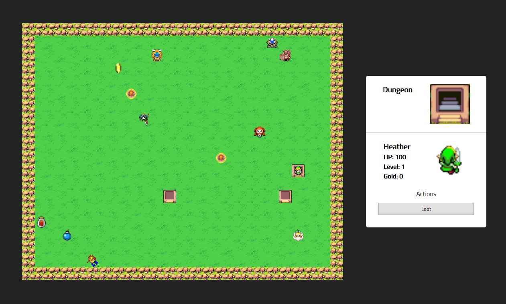

# Adventure Game

This game was an object-oriented programming project for the Concordia web development program. It was built as a desktop browser game where players navigate with arrow keys.

## Players can:
- Travel around and collect items from the game board
- Fight monsters to win experience points and collect items and gold
- Buy and sell items from the trader
- Search dungeons to collect gold and items
- Win the game by finding and unlocking the dungeon containing the lost puppy
## Technologies used:
This project was built using vanilla JavaScript, HTML, and CSS

This game can be played at [heathermartin.ca/adventure/index.html](http://heathermartin.ca/adventure/index.html).